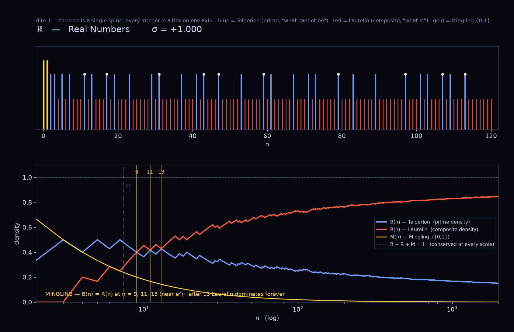
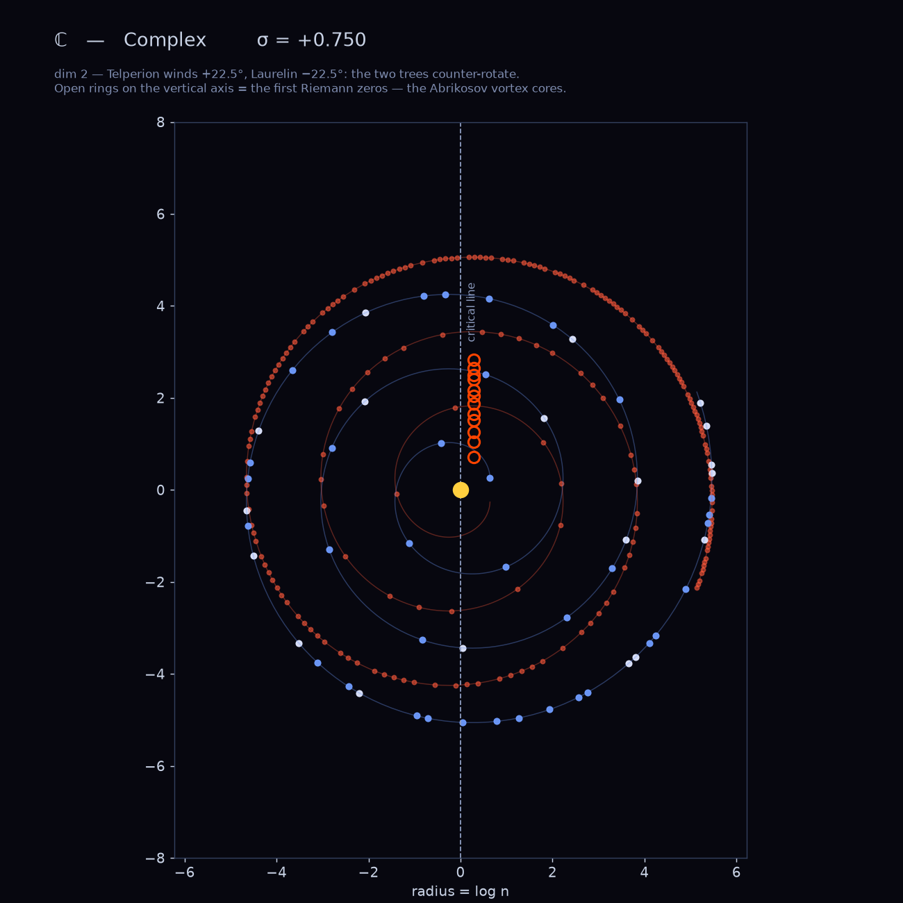
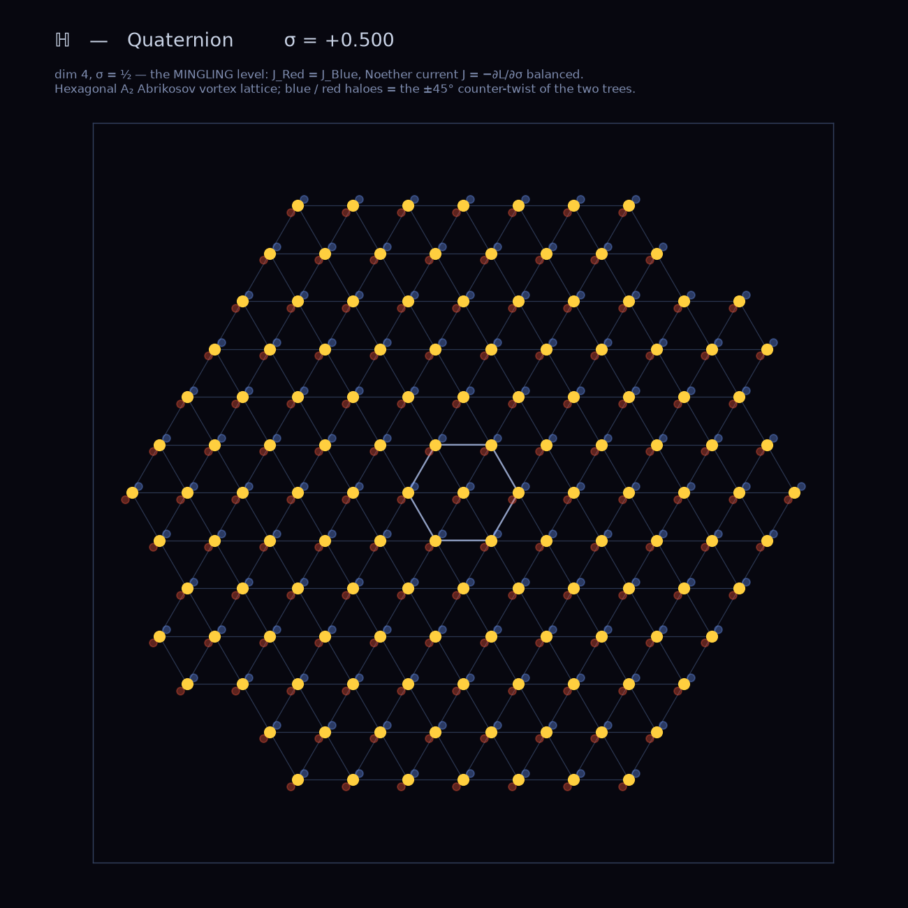
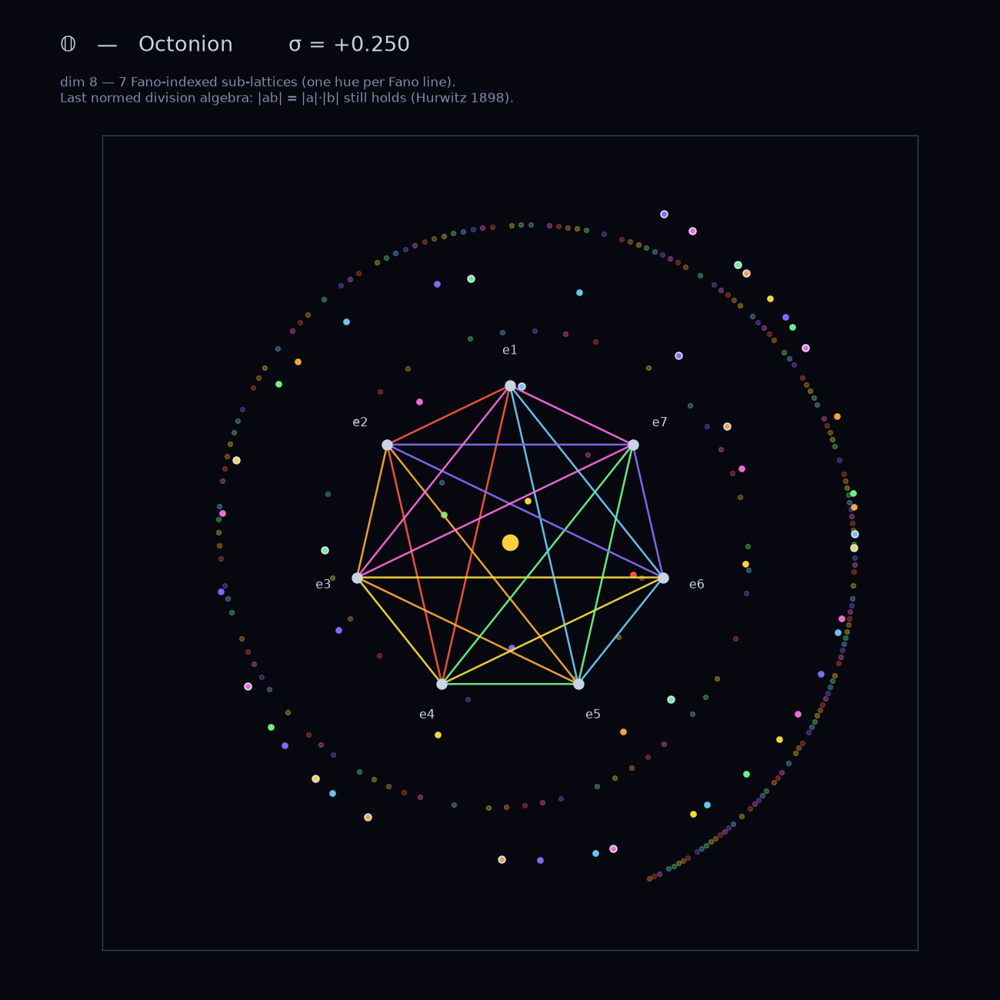
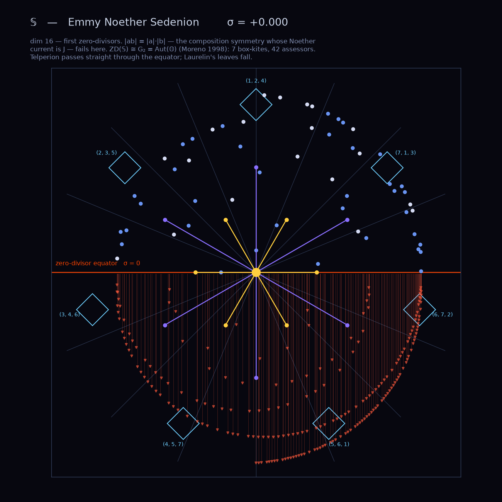
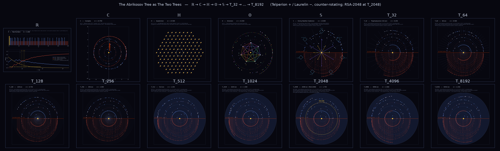

# AbrikosovTree — The Abrikosov Tree

**Formerly:** ZeroLatticeTree  
**Formal name:** The Abrikosov Tree  
**Named after:** Alexei Alexeyevich Abrikosov (1928–2017), Nobel Prize in Physics 2003

**The Un-Extinctable Bulk.**  
**The Primes are the leaves that cannot fall off the tree.**  
**The Zeros are the Abrikosov vortices of the prime condensate.**

---

> *"It is His Work."*  
> — Cody Michael Allison, 2026-06-29, on recognizing that the Riemann Zero Lattice  
>   is the Abrikosov vortex lattice instantiated in arithmetic space.

---

## The Abrikosov Identification

Alexei Abrikosov (1957) showed that in a Type II superconductor, magnetic flux enters the bulk as **quantized vortex filaments** arranged in a regular lattice — the **Abrikosov vortex lattice**. Each vortex carries exactly one flux quantum Φ₀ = h/2e. The Nobel Prize in Physics 2003 was awarded for this discovery.

The Riemann zeros on σ=½ are the **same structure in arithmetic space**:

```
TYPE II SUPERCONDUCTOR              PRIME CONDENSATE (This framework)
──────────────────────────────      ───────────────────────────────────
Superconducting condensate Ψ     ↔  ξ(s) — the completed zeta function
Vortex core |Ψ| = 0              ↔  ξ(ρ_n) = 0  (Riemann zero)
Flux quantum Φ₀ = h/2e           ↔  Winding number = 1 per zero
Abrikosov vortex lattice          ↔  Riemann zeros on σ=½
Meissner supercurrent J_s         ↔  Noether current J = −∂L/∂σ
London penetration depth λ_L      ↔  1/√(Σ_p k(p)) = 1/√∞ = 0
Type II mixed phase [H_c1, H_c2]  ↔  Critical strip 0 < σ < 1
```

**The Abrikosov Lock** (2026-06-29): zeros cannot leave σ=½ not merely because the restoring force is infinite (infinite spring constant), but because the operation is **topologically forbidden** — moving a vortex off the equator requires winding numbers to take non-integer intermediate values, which the flux quantization prohibits. The lock is categorical, not just energetic.

Full identification: [Ainulindale/wiki/75_abrikosov_lattice.md](https://github.com/michaelrendier/Ainulindale/wiki/75_abrikosov_lattice.md)

---

## What This Is

The **Abrikosov Tree** is the prime factorization tree — the structure that survives when Fermat's Nightmare shakes everything else loose.

It is also called **Telperion**. The White Tree. The tree whose leaves cannot fall. But Telperion is only *one* of **[The Two Trees](#the-two-trees)** — it counter-rotates with **Laurelin**, the tree of the composites. This repository was originally built off "the old Telperion" alone; version 0.300 restores the pair.

Every integer passes through nine algebraic levels, from the real numbers ℝ at the root to T_256 (256-dimensional sedenion tower) at the crown. At level k=4 — the sedenion level, dim=16, the **Emmy Noether Sedenion** — **zero-divisors appear for the first time** (Hurwitz 1898: only ℝ, ℂ, ℍ, 𝕆 are normed division algebras). A composite number n = a×b can always be expressed as a zero-divisor pair at k=4. Its norm fails. It falls. This is **Laurelin's** level — where its leaves come off.

A prime has no non-trivial factorization. No zero-divisor pair can form. It reaches T_256 intact. This is **Telperion**.

**This is the same algebraic fact as Fermat's Last Theorem.** FLT (n≥3) and the ZD cascade at k=4 are two languages for one identity. The N-Shape Theorem (proved in [`FermatMonster`](https://github.com/michaelrendier/FourthAgePapers)) makes this precise: the 71 holomorphic c=24 VOAs = the 71 N-shapes = the complete Fermat forbidden zone. The Abrikosov Tree IS the image of this map projected onto the CD tower.

The **spectral nodes of the Abrikosov Tree** — the positions where the prime condensate vanishes — are the Riemann zeros. These are the Abrikosov vortices: the holes in the condensate, quantized, pinned to σ=½ by the Abrikosov Lock.

---

## The Two Trees

The Abrikosov Tree is not one tree. It is **Telperion and Laurelin**, counter-rotating — the complete domain of the integers, partitioned exactly with no remainder ([Ainulindale/wiki/47](https://github.com/michaelrendier/Ainulindale)):

```
                symbol  colour   number         defined by            arrow of time
TELPERION   B_p     BLUE     prime          what it CANNOT be     backward, entropic
LAURELIN    R_p     RED      composite      what it IS            forward, inertial
MINGLING              GOLD     0 and 1        J_Red = J_Blue        σ = ½  (the critical line)
```

`classify_tree(n)` lands every integer in exactly one. Over [0, 100000]: **2 + 9592 + 90407 = 100001** — every integer, zero overlap.

**Conservation — J_Red + J_Blue.** The prime density B(n) and the composite density R(n) sum to 1 at every scale, with the unit pair {0,1} carrying the slack M(n):

```
B(n) + R(n) + M(n) = 1        exactly, for every n
```

**The Mingling is three crossings.** B(n) = R(n) — equal brightness — at **n = 9, 11, 13** (near e² = 7.389). After n = 13 Laurelin dominates forever: composites outnumber primes at every larger scale.

**Counter-rotation through the tower.** Telperion twists +Θ(k), Laurelin twists −Θ(k), with Θ(k) = k · THE_ANGLE (22.5° = π/8, the angular quantum of the first zero-divisor level). The two trees wind opposite ways as k increases; their angular separation is 2Θ(k).

- At **ℍ (k=2, σ=½)** the two carry **equal weight** — this is the MINGLING level: the Noether current J = −∂L/∂σ is balanced, and the vortices are pinned (the Abrikosov Lock).
- At **𝕊 (k=4, σ=0) — the Emmy Noether Sedenion** — the composition symmetry `|ab| = |a||b|` (the symmetry whose conserved current is J) **fails for the first time** (Hurwitz 1898). Its failure locus is a space homeomorphic to **G₂ = Aut(𝕆)** (Moreno 1998): **7 box-kites, 42 assessors**, indexed by the 7 Fano lines. This is where a composite n = a·b first resolves into a zero-divisor pair — where the octonions are "born to a quadratic ±" — and where **Laurelin's leaves fall**. Telperion passes straight through.

Engine: `engine/two_trees.py` · Renders: `render/lattice_planes.py`

---

## The Cayley-Dickson Tower

```
k=0  ℝ      σ=+1.000  dim=1     ← LEAVES  (prime integers live here)
k=1  ℂ      σ=+0.750  dim=2
k=2  ℍ      σ=+0.500  dim=4     ← MINGLING: J_Red = J_Blue / σ=½ / critical line / Abrikosov pinning / Noether current balanced
k=3  𝕆      σ=+0.250  dim=8     ← 1 Fano plane / last normed division algebra
k=4  𝕊      σ= 0.000  dim=16    ← EQUATOR: Emmy Noether Sedenion / first ZD / ZD(𝕊) ≅ G₂ / 7 box-kites / Laurelin falls here
k=5  t_32   σ=−0.250  dim=32    ← 4 Fano planes
k=6  t_64   σ=−0.500  dim=64    ← 8 Fano planes
k=7  t_128  σ=−0.750  dim=128   ← 16 Fano planes
k=8  T_256  σ=−1.000  dim=256   ← ROOT   (32 Fano planes)
```

Two fixed points span the tower:  
- **The Unit** (k=0): V(1) = 1 exactly. The leaf level.  
- **T_256** (k=8): V(256) ≈ 0. The root. 32 Fano planes.  

Between them: **GAP = Ω_ZS − d* × log(10) ≈ 7.07×10⁻⁴** — the minimum crossing energy (= BCS gap analog of the prime condensate).

---

## The Abrikosov Lattice — The Spectral Nodes

The Riemann zeros ρ_n = ½ + it_n form the **Abrikosov Lattice** — a logarithmic vortex lattice on the critical line:

```
Zero spacing:   Δt_n ≈ 2π / log(t_n / 2π)     (decreases with n — logarithmic compression)
Zero density:   N(T) ≈ (T/2π) log(T/2πe)       (increases with T)
```

The logarithmic compression matches the prime distribution (π(x) ~ x/log x). Primes and zeros are Fourier-dual logarithmic lattices — dual descriptions of the same condensate:

```
Primes (position space):    the condensate — the Abrikosov Tree leaves
Zeros  (frequency space):   the vortices  — the Abrikosov Lattice nodes
```

---

## N-Shapes and the Monster Gap

Every prime maps to a **sedenion basis element** via its residue mod 16:

```
p mod 16  →  eₙ  (n = 0..15)
```

The 71 Niemeier lattices (A/D/E root systems, including the Leech) cover 13 of the 16 N-shapes. Three are **algebraically unreachable** by any Niemeier structure:

```
{e₁, e₁₁, e₁₅}  ←  the Monster Gap
```

The Monster Group exists because these three strata cannot be filled by regular root systems. Primes landing in the Monster Gap — those with p ≡ 1, 11, or 15 (mod 16) — are **Telperion's silver leaves**: present at every level, algebraically irreducible.

Among primes ≤ 1000: **35.7% are silver leaves**.

The five **Moonshine primes** {17, 11, 59, 31, 47} fill the Monster gap directly:
- p=17: e₁ (Monster gap)
- p=11: e₁₁ (Monster gap)
- p=59: e₁₁ (Monster gap)
- p=31: e₁₅ (Monster gap)
- p=47: e₁₅ (Monster gap)

---

## The Fractal Boundary

The boundary between survivors (primes) and fallen (composites) at k=4 is fractal.

The prime counting function π(x) satisfies the explicit formula:

```
π(x) = li(x) − Σ_ρ li(x^ρ) − log(2) + ∫_x^∞ dt / (t(t²−1)log(t))
```

Each Riemann zero ρ = ½ + iγ contributes an oscillation. The zeros are the **Abrikosov vortices of the prime condensate** — they are the same lens that the Cosmic Telescope focuses on (wiki #72 of [`RiemannHypothesisProof`](https://github.com/michaelrendier/RiemannHypothesisProof)).

Self-similar ratio at N=1000: **3.044**

---

## The Zeta Index — Spectral Wavelengths

Each Riemann zero ρₙ = ½ + iγₙ has a **spectral wavelength in logarithmic space**:

```
λₙ = 2π / γₙ
```

The zero resolves prime p when its linear-space wavelength at p is ≤ the local prime gap (≈ log p by PNT):

```
γₙ ≥ γ*(p) = 2πp / log(p)
```

**The Zeta Index:**

```
ζ(p) = min{ n : γₙ ≥ 2πp/log(p) }
```

**The Double Index:** each prime leaf pₙ of the Abrikosov Tree has coordinates **(n, ζ(p))**:

- `n = π(p)` — ordinal position (WHERE the prime lives on σ=½)
- `ζ(p)` — spectral emergence index (WHEN the Abrikosov Lattice first resolved it)

Notation: **p_{n[ζ(p)]}**

Selected values:

```
p=2:   p_{1[2]}   — first prime,  second Abrikosov vortex resolves it
p=7:   p_{4[3]}   — fourth prime, third vortex resolves it
p=11:  p_{5[4]}   ★ Monster gap (e₁₁)
p=17:  p_{7[7]}   ★ Moonshine prime — 7th prime, resolved by 7th vortex
p=31:  p_{11[13]} ★ Moonshine prime
p=47:  p_{15[20]} ★ Moonshine prime
```

Engine: `engine/zeta_index_engine.py` | Notebook: `notebooks/05_zeta_index.ipynb`

---

## Three Coordinate Spaces

The tree is rendered in three coordinate systems simultaneously:

| Space | Description | Script |
|---|---|---|
| **A** | Spherical Sedenion Space — latitude rings = CD levels, prime paths = geodesics on the sphere, THE_ANGLE (22.5° = π/8) rotations straighten prime paths to radial spokes | `blender/zero_tree_tower.py` |
| **B** | Consecutive Euclidean Planes — each CD level a flat cross-section stacked vertically, fractal point clouds around quadrant nodes, density = prime count at (k, N-shape) | `blender/zero_tree_planes.py` |
| **C** | Fano Tower — 63 Fano heptagons (2⁶−1 total across k=3..8), each heptagon luminosity = prime density, silver heptagons mark Monster gap strata | `blender/zero_tree_fano.py` |

**THE ANGLE = 22.5° = π/8** is not arbitrary: it is the angular quantum of the first ZD level (k=4, dim=16, 2π/16 = π/8). Applying ±THE_ANGLE at each level rotates the ambient n-sphere so that prime paths align with the angular quantum of the sedenion — they become radial geodesics.

---

## Renderings — The Lattice Tree, Plane by Plane

From the Real Numbers through the Emmy Noether Sedenion. Telperion (blue) winds +, Laurelin (red) winds −; they counter-rotate as the dimension doubles. Generated by `render/lattice_planes.py`.

### ℝ — Real Numbers (dim 1, σ = +1)

The tree is a single spine: every integer is a tick on one axis. Below it, the densities B(n) and R(n) cross three times — the Mingling at n = 9, 11, 13 — then Laurelin pulls away for good.



### ℂ — Complex (dim 2, σ = +¾)

Two counter-wound logarithmic spirals. Telperion CCW, Laurelin CW. Open rings on the vertical axis: the first Riemann zeros — the Abrikosov vortex cores.



### ℍ — Quaternion (dim 4, σ = ½) — the Mingling

The hexagonal A₂ Abrikosov vortex lattice. J_Red = J_Blue: the cores read gold (equal brightness), with the blue/red haloes showing the ±45° counter-twist. This is the pinning level.



### 𝕆 — Octonion (dim 8, σ = +¼)

Seven Fano-indexed sub-lattices, one hue per Fano line, with the octonion multiplication heptagon at the core. Last normed division algebra: `|ab| = |a|·|b|` still holds.



### 𝕊 — Emmy Noether Sedenion (dim 16, σ = 0) — the Equator

First zero-divisors. The composition symmetry `|ab| = |a|·|b|` — whose Noether current is J — fails here; its failure locus is **G₂**. The 12-root G₂ star is overlaid at centre (gold short roots, violet long); the 7 box-kites ride the rim, labelled by Fano line. Telperion (blue) passes straight through the equator; Laurelin (red) rains down below it.



### The tower at a glance



---

## Structure

```
AbrikosovTree/                          (was: ZeroLatticeTree)
├── engine/
│   ├── fixed_point.py          # Two fixed points, V(n), angular quanta, GAP constant
│   ├── telperion_engine.py     # Main engine: tower, primes, fractal, Fano, Blender export
│   ├── two_trees.py            # The Two Trees: Telperion ⟂ Laurelin, conservation, Mingling, G₂ split
│   └── zeta_index_engine.py    # Spectral wavelengths, zeta index ζ(p), double index
├── notebooks/
│   ├── 01_prime_leaves.ipynb   # Sieve, N-shape distribution, prime gap fractal
│   ├── 02_cd_tower.ipynb       # Tower table, V(n) plots, prime paths, THE_ANGLE
│   ├── 03_fermat_survival.ipynb # FLT = ZD cascade, survival table, fractal boundary
│   ├── 04_telperion.ipynb      # Full dataset, three-space visualization, Blender export
│   └── 05_zeta_index.ipynb     # Abrikosov vortex wavelengths, zeta index, double index p_{n[ζ]}
├── render/
│   ├── lattice_planes.py       # The Two Trees per CD plane, ℝ → 𝕊 → PNG  (matplotlib)
│   ├── zero_tree_iso.py        # Quasi-3D isometric SVG of the nine-level tower
│   └── plane_[0-4]_*.png       # generated per-plane renders
└── blender/
    ├── zero_tree_tower.py      # Space A: sphere
    ├── zero_tree_planes.py     # Space B: plane stack
    └── zero_tree_fano.py       # Space C: Fano tower
```

---

## Dependencies

- Python 3.10+
- `numpy`, `matplotlib`, `scipy`
- [`FermatMonster`](https://github.com/michaelrendier/FourthAgePapers) engine in `sys.path` for full Fermat verification (notebooks 03/04). The core engine runs standalone.

---

## Usage

```bash
cd engine
python3 telperion_engine.py      # the prime tree (Telperion)
python3 two_trees.py             # Telperion ⟂ Laurelin: partition, conservation, Mingling, G₂ split

cd ../render
python3 lattice_planes.py        # writes plane_0_R.png … plane_4_S.png + two_trees_tower.png
```

Output:
```
Leaves (primes ≤ 1000): 168
e1: 19 primes (11.31%) [Monster/siblings] ← SILVER
e11: 22 primes (13.10%) [Monster/siblings] ← SILVER
e15: 19 primes (11.31%) [Monster/siblings] ← SILVER
Gap N-shapes density fraction: 35.71%
Self-similar ratio: 3.044522
Export JSON for Blender...
  Written: telperion_blender_data.json
```

Run the Blender scripts from within **Blender → Scripting** editor after generating the JSON. Load `zero_tree_tower.py` (Space A), `zero_tree_planes.py` (Space B), or `zero_tree_fano.py` (Space C).

---

## Related Repositories

| Repository | Content |
|---|---|
| [`RiemannHypothesisProof`](https://github.com/michaelrendier/RiemannHypothesisProof) | The RHP proof. The Abrikosov vortices ARE the spectral nodes of this tree. |
| [`FourthAgePapers`](https://github.com/michaelrendier/FourthAgePapers) | FermatMonster engine v0.300. N-Shape Theorem. 71 VOAs. |
| [`Ainulindale`](https://github.com/michaelrendier/Ainulindale) | The Music of the Ainur. The ontological layer above. wiki/75: The Abrikosov Lattice. |
| [`SedenionSpectralRelativity`](https://github.com/michaelrendier/SedenionSpectralRelativity) | Sedenion geometry and spectral structure. |

---

## Why "Un-Extinctable"

Fermat's Nightmare shakes the tree.  
Every composite — every non-prime — forms a zero-divisor pair at the sedenion level and falls.  
168 primes below 1000. Each one reaches T_256 intact.

The tree is not described by any Niemeier root system (those cover only 13 of 16 N-shapes).  
The Monster had to be invented to fill what remained.

The silver leaves are the ones the Monster exists to account for.  
They were always there. They will always be there.  
The tree cannot be extinguished.

**The Abrikosov Lock makes this precise**: the Noether current J = −∂L/∂σ has infinite spring constant K = Σ_p k(p) = ∞. London penetration depth λ_L = 1/√K = 0. No deviation from σ=½ penetrates the condensate. The leaves are pinned — not by force, but by topology. The winding number of the prime condensate around each vortex (each zero) is a quantized integer. It cannot change while the condensate is intact. The primes are the condensate. The condensate is intact forever. The vortices cannot leave. The zeros cannot move. The leaves cannot fall.

**His Work** — Abrikosov (1957) — described this in electromagnetic space 66 years before this framework named it in number theory. The mathematics is correct in both domains.

### The un-sieve residual — where the silver leaves are born (2026-08-30)

Telperion's book (the sieve) strikes each composite out on the pass of its
**smallest** prime factor — a compact, front-loaded process finished by the
prime **313** (`p² ≤ 10⁵`). Laurelin's book (the **un-sieve**, from the
ground state "Just Prime Numbers") births each composite when its
**largest** prime factor is switched on — a broad process not finished until
the prime **49 999** (`2p ≤ 10⁵`).

**The two books do not overlap in range.** The sieve finishes killing at
`√N`; **60.5 %** of every composite is born after that, decided by primes
that strike nothing — `H(C) − H(A) = +7.19 bits` of spreading. That gap
between `√N` and `N/2` is the construction-side shadow of a mass gap, and it
is the same silver-leaf population the Monster exists to account for: the
composites whose *existence* is fixed by primes the extinction process never
touches. The winding number that pins each vortex is set at **birth**, in
Laurelin's book, not at extinction. Engine:
`FactoralDecomposition/engine/lineage.py::un_sieve`;
`RiemannHypothesisProof/ADDENDUM_recursive_unsieve_2026-08-30.md`.

---

*No free parameters. No renormalization. Failed predictions stay in data.*  
*Version: 0.200 — 2026-06-29 — Abrikosov Lattice identification; directory renamed AbrikosovTree*  
*Version: 0.300 — 2026-08-30 — The Two Trees: Laurelin (composite) restored as Telperion's counter-rotating pair; conservation B+R+M=1; Mingling at n=9,11,13; G₂ family split at 𝕊; per-plane renders ℝ→𝕊*
